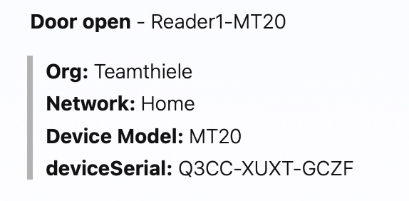

# Cancom / Cisco - DevNet Express Meraki 
## Lab Training

für das Training könnt ihr euch bitte alle Lib´s aus der requirements.txt Datei installieren.

```shell
pip install -r requirements.txt
```


### Mittwoch Session 16:20 Uhr
Meraki MT Sensor overview with all auto generated for uses cases

In der ersten Aufgabe fragen wir die Meraki API nach der Temperatur des jeweiligen Sensors in eurer Meraki Organisation.

Den fertigen Code für die erste Aufgabe findet ihr in der Datei 
```
Temperatur.py
```
Hier bitte die Network ID mit der von euch tauschen. Achtet auch, dass ihr den richtigen Meraki Access Token als Umgebungsvariable setzt. Die **Serial** Number des Sensors im Querystring muss angepasst werden.

Die Ausgabe der Daten mitels Figlet ist nur eine optionale Spielerei:
```Python
# Ausgabe der Daten 
f = Figlet(font='banner3')
cls()
print (f.renderText(Temp))
print ('\nTEMP MIN')
print (f.renderText(Tempmin))
print ('\nTEMP MAX')
print (f.renderText(Tempmax))
```

so sollte es nun aussehen:
<p align="center"> 

</p>


### Donnerstag Session 9:30 Uhr
Create a Webhook receiver for alarm messagges from Meraki IoT devices.

Die zweite Aufgabe umfasst 
* das Anlegen eines Webhooks im Meraki Dashboard
* das Aufsezen eines Webservers, der auf die Events des Webhook hört und diese ausgibt
* das Nutzen von NGROK als Tunel Dienst zu eurem Webserver.

Den fertigen Code für die zweite Aufgabe findet ihr in der Datei 
```
Webhook_receiver.py
```

Nicht vergessen NGROK zu starten

```shell
ngrok http 80

```


### Donnerstag Session 10:45 Uhr
Providing messages to Webex Teams/alarm spaces

Nach dem wir nun einen Webserver besitzen, der die Alarmmeldungen von Meraki empfangen und ausgeben kann wollen wir dieses Programm dahin erweitern, das die Ausgabe in einem Webex Space erfolgt.

Die dritte Aufgabe umfasst:
* Empfangen der Alarmmeldung von Meraki über unseren Webserver
* Erstellen eines Webex Teams Alarm Space (zuvor alle alten Alarm Spaces löschen)
* Teilnehmer dem Alarmraum hinzufügen
* Alarmmeldung in den Webex Space senden

Den fertigen Code für die dritte Aufgabe findet ihr in der Datei 
```
Webhook_receiver_Webex.py
```

Die Alarm Message im Webex Space sollte in etwa so aussehen. Gerne könnt ihr diese anpassen:
<p align="center"> 

</p>


Nun ist es an euch, sich Erweiterungen zu überlegen. Zum Beispiel:
* Ausgabe der Webex Nachricht als "Card"
* Automtisches Abfragen der NGROK Tunnel Adresse
* und setzen des Webhooks über die API mit der erstellt NGROK Tunnel Adresse aus dem Script heraus

